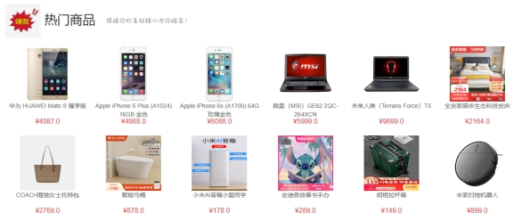

# 基于SSM框架的商城

## 商城的基本功能

### 用户

1. 登录、注册和注销
2. 修改个人信息
3. 首页查看所有类别的商品
4. 展示热门商品、最新商品和商品专区
5. 搜索商品
6. 加入购物车，购买商品
7. 提交和支付订单
8. 查看订单状态
9. 查看订单详情

### 管理员

1. 管理商品的上下架和修改商品内容

2. 监控商品的订单情况，处理发货操作

   

### 结果展示：

1．首页导航栏

 

2．首页热门商品

 

3．首页最新商品

 

4．首页史迪仔专区

 

5．根据关键词搜索商品

 

6．点击不同类别查询商品信息

 

7．用户注册

 

8．用户登录

 

9．管理员登录

 

10．购物车

 

11．我的订单

 

12．商城后台管理

 

